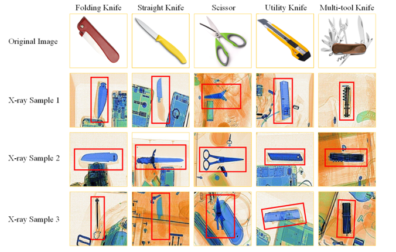
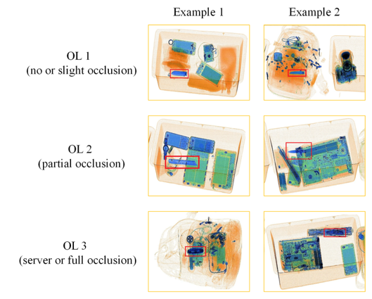

  English | <a href="https://github.com/DIG-Beihang/XrayDetection/blob/master/readme_chinese.md">简体中文</a>

# Object Detection Under X-ray Security Inspection Scenario: Dataset & Papers 📌

📈 This is the summary web of open source dataset and critical papers for Object Detection under X-ray security inspection scenario done by the research group in the State Key Laboratory of Software Development Environment (SKLSDE) at Beihang University. We hope our work can contribute to the community and encourage more researchers to continue to work in this field.

## Introduction

This is the summary web of open source dataset and critical papers for Object Detection under X-ray security inspection scenario done by the research group in the State Key Laboratory of Software Development Environment (SKLSDE) at Beihang University. We hope our work can contribute to the community and encourage more researchers to continue to work in this field.

# Table of Contents

- [Introduction](#introduction)

- [Datasets](#1-released-datasets-for-xray-object-detection)
  - [OPIXray](#1opixray-occluded-prohibited-items-x-ray)
  - [HiXray](#2hixray-high-quality-x-ray)
  - [EDS](#3eds-endogenous-domain-shift)
  - [Xray FSOD](#4xray-fsod)

## 1. Released Datasets for Xray Object Detection

### 1）OPIXray: Occluded Prohibited Items X-ray
Occluded Prohibited Items X-ray(OPIXray) is the first high-quality object detection dataset for security inspection.

The backgrounds of all samples in OPIXray are scanned by the security inspection machine and each prohibited item is annotated manually by professional inspectors from the international airport, which localized by a box-level annotation with a bounding box. 

* Download Link: https://github.com/OPIXray-author/OPIXray

OPIXray dataset consists of:

* Altogether 8885 X-ray images
* 5 categories of cutters: 
  - Folding Knife: 1993 images
  - Straight Knife：1044 images
  - Scissor：1863 images
  - Utility Knife：1978 images
  - Multi-tool Knife：2042 images

* All images are stored in JPG format with the resolution of 1225*954. 

The dataset is partitioned into a training set and a testing set, with the former containing 80% of the images (7109) and the latter containing 20% (1776), where the ratio is about 4 : 1. In order to study the impact brought by object occlusion levels, the testing set was divided into three subsets named as Occlusion Level 1 (OL1), Occlusion Level 2 (OL2) and Occlusion Level 3 (OL3), where the number indicates occlusion level of prohibited items in images. 

👆 [<b>BACK to Table of Contents</b> -->](#table-of-contents)
### 2）HiXray: High-quality X-ray
HiXray is a large high-quality dataset for prohibited items detection in X-ray images, which is gathered from real-world daily security inspections in an international airport. Each instance is manually annotated by professional inspectors from the international airport, guaranteeing the accurate annotations.

* Download Link: https://github.com/HiXray-author/HiXray

HiXray dataset consists of:

* Altogether 45,364 X-ray images
* 8 categories of 102,928 common prohibited items:
  - Portable Charger 1 (PO1): 12421 prohibited items
  - Portable Charger 2 (PO2): 7788 prohibited items
  - Water(WA): 3092 prohibited items
  - Laptop(LA): 10042 prohibited items
  - Mobile phone(MP): 53835 prohibited items
  - Tablet(TA): 4918 prohibited items
  - Cosmetic(CO): 9949 prohibited items
  - Nonmetallic Lighter(NL): 883 prohibited items

* All images are stored in JPG format with a 1200*900 resolution,  resolution, averagely. 
* The maximum resolution of samples can reach 2000*1040

The dataset is partitioned into a training set and a testing set, where the ratio is about 4 : 1.
👆 [<b>BACK to Table of Contents</b> -->](#table-of-contents)

### 3）EDS: Endogenous Domain Shift

👆 [<b>BACK to Table of Contents</b> -->](#table-of-contents)

### 4）Xray FSOD

The dataset is constructed from images of defected electrical commutators that were provided and annotated by Kolektor Group. Specifically, microscopic fractions or cracks were observed on the surface of the plastic embedding in electrical commutators. The surface area of each commutator was captured in eight non-overlapping images. The images were captured in a controlled environment.

 

- Official Link:https://www.vicos.si/Downloads/KolektorSDD

- Download Link：https://pan.baidu.com/share/init?surl=HSzHC1ltHvt1hSJh_IY4Jg (password：``1zlb``)

The dataset consists of:

- 50 physical items (defected electrical commutators)
- 8 surfaces per item
- Altogether 399 images: 
-- 52 images of visible defect 
-- 347 images without any defect
- Original images of sizes: 
-- width: 500 px 
-- height: from 1240 to 1270 px
- For training and evaluation images should be resized to 512 x 1408 px

For each item the defect is only visible in at least one image, while two items have defects on two images, which means there were 52 images where the defects are visible. The remaining 347 images serve as negative examples with non-defective surfaces.

 

👆 [<b>BACK to Table of Contents</b> -->](#table-of-contents)

