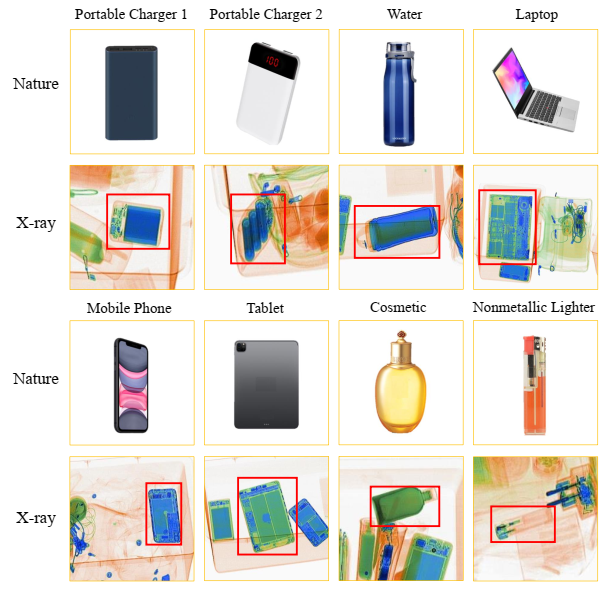
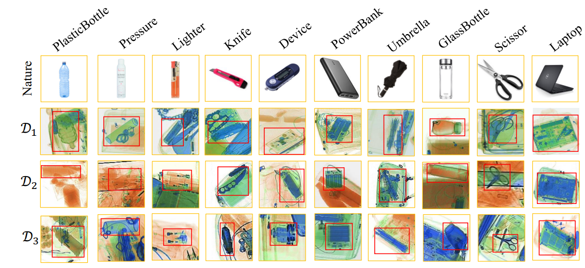
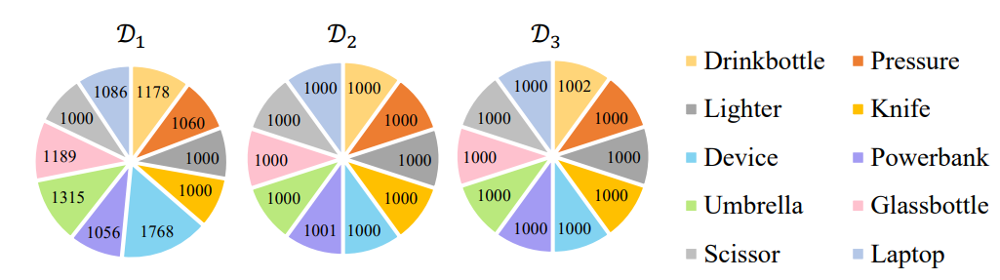
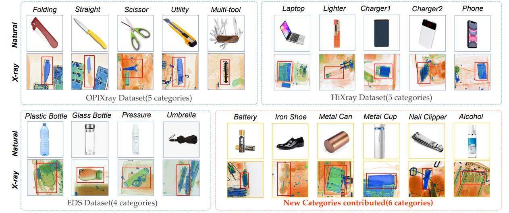

# Object Detection Under X-ray Security Inspection Scenario: Dataset & Papers 📌

This is the summary web of open source datasets and critical papers for Object Detection under X-ray security inspection scenario done by the research group in the State Key Laboratory of Software Development Environment (SKLSDE) at Beihang University. **The datasets can only be used for ACADEMIC PURPOSES. NO COMERCIAL USE is allowed**. We hope our work can contribute to the community and encourage more researchers to continue to work in this field.

## Table of Contents

- [Introduction](#introduction)

- [News](#news)

- [Datasets](#1-released-datasets-for-xray-object-detection)
  - [OPIXray](#1opixray-occluded-prohibited-items-x-ray)
  - [HiXray](#2hixray-high-quality-x-ray)
  - [EDS](#3eds-endogenous-domain-shift)
  - [Xray FSOD](#4x-ray-fsod)

- [Papers](#2-critical-papers-for-xray-object-detection)
  - [DOAM](#1occluded-prohibited-items-detection-an-x-ray-security-inspection-benchmark-and-de-occlusion-attention-module)
  - [LIM](#2towards-real-world-x-ray-security-inspection-a-high-quality-benchmark-and-lateral-inhibition-module-for-prohibited-items-detection)
  - [PSN](#3exploring-endogenous-shift-for-cross-domain-detection-a-large-scale-benchmark-and-perturbation-suppression-network)
  - [WEN](#4few-shot-x-ray-prohibited-item-detection-a-benchmark-and-weak-feature-enhancement-network)

## Introduction

## News
**[2022.06.29]** One [paper](#4few-shot-x-ray-prohibited-item-detection-a-benchmark-and-weak-feature-enhancement-network) for Few-shot X-ray Detection is accepted by ACM MM 2022.

**[2022.03.02]** One [paper](#3exploring-endogenous-shift-for-cross-domain-detection-a-large-scale-benchmark-and-perturbation-suppression-network) for cross-domain object detection is accepted by CVPR 2022.

**[2021.12.19]** We hold the "Prohibited Items Detection Under X-ray Security Inspection Scenario" Forum on the 4th Chinese Conference on Pattern Recognition and Computer Vision

**[2021.07.23]** One [paper](#2towards-real-world-x-ray-security-inspection-a-high-quality-benchmark-and-lateral-inhibition-module-for-prohibited-items-detection) for object detection is accepted by ICCV 2021.

**[2020.07.26]** One [oral paper](#1occluded-prohibited-items-detection-an-x-ray-security-inspection-benchmark-and-de-occlusion-attention-module) for De-occlusion X-ray Detection is accepted by ACM MM 2020.

## 1. Released Datasets for Xray Object Detection

### 1）OPIXray: Occluded Prohibited Items X-ray
Occluded Prohibited Items X-ray(OPIXray) is the first high-quality object detection dataset for security inspection.

The backgrounds of all samples in OPIXray are scanned by the security inspection machine and each prohibited item is annotated manually by professional inspectors from the international airport, which localized by a box-level annotation with a bounding box. 

* Download Link: If you want to access the dataset, please sign the <a href="https://github.com/DIG-Beihang/XrayDetection/blob/master/Commitment_OPIXray.pdf">PDF</a> file and send it to cvresearcher@163.com. After receiving your request, we will rely with the download link soon.

OPIXray dataset consists of:

* Altogether 8885 X-ray images
* 5 categories of cutters: 
  - Folding Knife: 1993 images
  - Straight Knife：1044 images
  - Scissor：1863 images
  - Utility Knife：1978 images
  - Multi-tool Knife：2042 images

* All images are stored in JPG format with the resolution of 1225*954. 

The dataset is partitioned into a training set and a testing set, with the former containing 80% of the images (7109) and the latter containing 20% (1776), where the ratio is about 4 : 1. In order to study the impact brought by object occlusion levels, the testing set was divided into three subsets named as Occlusion Level 1 (OL1), Occlusion Level 2 (OL2) and Occlusion Level 3 (OL3), where the number indicates occlusion level of prohibited items in images. 

👆 [<b>BACK to Table of Contents</b> -->](#table-of-contents)
### 2）HiXray: High-quality X-ray
HiXray is a large high-quality dataset for prohibited items detection in X-ray images, which is gathered from real-world daily security inspections in an international airport. Each instance is manually annotated by professional inspectors from the international airport, guaranteeing the accurate annotations.

* Download Link: If you want to access the dataset, please sign the <a href="https://github.com/DIG-Beihang/XrayDetection/blob/master/Commitment_HiXray.pdf">PDF</a> file and send it to cvresearcher@163.com. After receiving your request, we will rely with the download link soon.

HiXray dataset consists of:

* Altogether 45,364 X-ray images
* 8 categories of 102,928 common prohibited items:
  - Portable Charger 1 (PO1): 12421 prohibited items
  - Portable Charger 2 (PO2): 7788 prohibited items
  - Water (WA): 3092 prohibited items
  - Laptop (LA): 10042 prohibited items
  - Mobile phone (MP): 53835 prohibited items
  - Tablet (TA): 4918 prohibited items
  - Cosmetic (CO): 9949 prohibited items
  - Nonmetallic Lighter (NL): 883 prohibited items

* All images are stored in JPG format with a 1200*900 resolution,  resolution, averagely. 
* The maximum resolution of samples can reach 2000*1040

The dataset is partitioned into a training set and a testing set, where the ratio is about 4 : 1.

👆 [<b>BACK to Table of Contents</b> -->](#table-of-contents)

### 3）EDS: Endogenous Domain Shift
Endogenous Domain Shift (EDS) dataset is the first endogenous domain shift benchmark, by selecting a typical scenario, X-ray security inspection. Due to the differences in intrinsic mechanisms or hardware components of the imaging systems of different types of X-ray machines, there are subtle perturbations in X-ray images generated by different X-ray machines, which cause the endogenous shift. 

* Download Link: If you want to access the dataset, please sign the <a href="https://github.com/DIG-Beihang/XrayDetection/blob/master/Commitment_EDS.pdf">PDF</a> file and send it to cvresearcher@163.com. After receiving your request, we will rely with the download link soon.

EDS dataset consists of:

* 3 different domains
* Altogether 14,219 X-ray images

* 10 categories of 31,654 common prohibited items. It is guaranteed that the instances in each category is no less than 1000, which is sufficient for the evaluation.

Three X-ray security inspection machines from different manufactures and with different serving time are exploited to generate three domains of images. We randomly put the objects in preprepared package to generate images. After sending the package to the security inspection machine, the machine will completely cut out the package by detecting the blank.

👆 [<b>BACK to Table of Contents</b> -->](#table-of-contents)

### 4）X-ray FSOD
X-ray FSOD dataset is the first weak-feature FSOD evaluation benchmark by selecting the typical scenario, X-ray security inspection. All the samples of X-ray FSOD dataset are generated by X-ray machines, where the texture information of prohibited items is almost eliminated by X-ray.

* Download Link: If you want to access the dataset, please sign the <a href="https://github.com/DIG-Beihang/XrayDetection/blob/master/Commitment_X-ray FSOD.pdf">PDF</a> file and send it to cvresearcher@163.com. After receiving your request, we will rely with the download link soon.

X-ray FSOD dataset consists of:

* Altogether 12,333 X-ray images
* 20 categories of 41,704 common prohibited items, where 16 categories are selected from three dataset, including 5 from OPIXray, 5 from HiXray and 4 from EDS Dataset, and other 6 categories are newly contributed:
  - **OPIXray**:
  - Folding (FO): 12421 prohibited items
  - Straight (PO2): 7788 prohibited items
  - Scissor (WA): 3092 prohibited items
  - Utility (LA): 10042 prohibited items
  - Multi-tool (MP): 53835 prohibited items
  - **HiXray**:
  - Laptop (TA): 4918 prohibited items
  - Lighter (CO): 9949 prohibited items
  - Charger1 (NL): 883 prohibited items
  - Charger2 (NL): 883 prohibited items
  - Phone (NL): 883 prohibited items
  - **EDS**:
  - Plastic Bottle (NL): 883 prohibited items
  - Glass Bottle (NL): 883 prohibited items
  - Pressure (NL): 883 prohibited items
  - Umbrella (NL): 883 prohibited items
  - **New**:
  - Battery (NL): 883 prohibited items
  - Iron Shoe (NL): 883 prohibited items
  - Metal Can (NL): 883 prohibited items
  - Metal Cup (NL): 883 prohibited items
  - Nail Clipper (NL): 883 prohibited items
  - Alcohol (NL): 883 prohibited items

The researchers exploit the X-ray security inspection machine and randomly put the objects in pre-prepared package to generate images. For other objects in the luggage, The researchers aim to simulate the real-world traveling luggage by putting some common items e.g., clothes, shoes. After sending the package to the security inspection machine, the machine will completely cut out the package by detecting the blank.

👆 [<b>BACK to Table of Contents</b> -->](#table-of-contents)

## 2. Critical Papers for Xray Object Detection

### 1）<a href="https://dl.acm.org/doi/10.1145/3394171.3413828"><papertitle>Occluded Prohibited Items Detection: An X-ray Security Inspection Benchmark and De-occlusion Attention Module</papertitle></a>
* Paper: https://arxiv.org/pdf/2004.08656.pdf
* Code: https://github.com/DIG-Beihang/OPIXray
* Dataset: [OPIXray](#1opixray-occluded-prohibited-items-x-ray)

Security inspection often deals with a piece of baggage or suitcase where objects are heavily overlapped with each other, resulting in an unsatisfactory performance for prohibited items detection in X-ray images. In the literature, there have been rare studies and datasets touching this important topic. In this work, we contribute
the first high-quality object detection dataset for security inspection, named Occluded Prohibited Items X-ray (OPIXray) image benchmark. OPIXray focused on the widely-occurred prohibited item "cutter", annotated manually by professional inspectors from the international airport. The test set is further divided into three occlusion levels to better understand the performance of detectors. Furthermore, to deal with the occlusion in X-ray images detection, we propose the De-occlusion Attention Module (DOAM), a plug-and-play module that can be easily inserted into and thus promote most popular detectors. Despite the heavy occlusion in X-ray imaging,
shape appearance of objects can be preserved well, and meanwhile different materials visually appear with different colors and textures. Motivated by these observations, our DOAM simultaneously leverages the different appearance information of the prohibited item to generate the attention map, which helps refine feature maps for the general detectors. We comprehensively evaluate our module on the OPIXray dataset, and demonstrate that our module can consistently improve the performance of the state-of-the-art detection methods such as SSD, FCOS, etc, and significantly outperforms several widely-used attention mechanisms. In particular, the advantages of DOAM are more significant in the scenarios with higher levels of occlusion, which demonstrates its potential application in real-world inspections. 

👆 [<b>BACK to Table of Contents</b> -->](#table-of-contents)
### 2）<a href="https://arxiv.org/abs/2108.09917"><papertitle>Towards Real-world X-ray Security Inspection: A High-Quality Benchmark And Lateral Inhibition Module For Prohibited Items Detection</papertitle></a>
* Paper: https://arxiv.org/pdf/2108.09917.pdf
* Code: https://github.com/HiXray-author/HiXray
* Dataset: [HiXray](#2hixray-high-quality-x-ray)

Prohibited items detection in X-ray images often plays an important role in protecting public safety, which often deals with color-monotonous and luster-insufficient objects, resulting in unsatisfactory performance. Till now, there have been rare studies touching this topic due to the lack of specialized high-quality datasets. In this work, we first present a High-quality X-ray (HiXray) security inspection image dataset, which contains 102,928 common prohibited items of 8 categories. It is the largest dataset of high quality for prohibited items detection, gathered from the real-world airport security inspection and annotated by professional security inspectors. Besides, for accurate prohibited item detection, we further propose the Lateral Inhibition Module (LIM) inspired by the fact that humans recognize
these items by ignoring irrelevant information and focusing on identifiable characteristics, especially when objects are overlapped with each other. Specifically, LIM, the elaborately designed flexible additional module, suppresses the noisy information flowing maximumly by the Bidirectional Propagation (BP) module and activates the most identifiable charismatic, boundary, from four directions by Boundary Activation (BA) module. We evaluate our method extensively on HiXray and OPIXray and the results demonstrate that it outperforms SOTA detection methods.

👆 [<b>BACK to Table of Contents</b> -->](#table-of-contents)

### 3）<a href="https://arxiv.org/abs/2108.09917"><papertitle>Exploring Endogenous Shift for Cross-domain Detection: A Large-scale Benchmark and Perturbation Suppression Network</papertitle></a>
* Paper: https://arxiv.org/pdf/2108.09917.pdf
* Code: https://github.com/DIG-Beihang/PSN
* Dataset: [EDS](#3eds-endogenous-domain-shift)

Existing cross-domain detection methods mostly study the domain shifts where differences between domains are often caused by external environment and perceivable for humans. However, in real-world scenarios (e.g., MRI medical diagnosis, X-ray security inspection), there still exists another type of shift, named endogenous shift, where the differences between domains are mainly caused by the intrinsic factors (e.g., imaging mechanisms, hardware components, etc.), and usually inconspicuous. This shift can also severely harm the cross-domain detection performance but has been rarely studied. To support this study, we contribute the first Endogenous Domain Shift (EDS) benchmark, X-ray security inspection, where the endogenous shifts among the domains are mainly caused by different X-ray machine types with different hardware parameters, wear degrees, etc. EDS consists of 14,219 images including 31,654 common instances from three domains (X-ray machines), with bounding-box annotations from 10 categories. To handle the endogenous shift, we further introduce the Perturbation Suppression Network (PSN), motivated by the fact that this shift is mainly caused by two types of perturbations: category-dependent and category-independent ones. PSN respectively exploits local prototype alignment and global adversarial learning mechanism to suppress these two types of perturbations. The comprehensive evaluation results show that PSN outperforms SOTA methods, serving a new perspective to the cross-domain research community.

👆 [<b>BACK to Table of Contents</b> -->](#table-of-contents)

### 4）<papertitle>Few-shot X-ray Prohibited Item Detection: A Benchmark and Weak-feature Enhancement Network</papertitle>
* Paper: Coming soon
* Code: https://github.com/wytbwytb/WEN
* Dataset: [Xray FSOD](#4x-ray-fsod)

X-ray prohibited items detection of security inspection plays an important role in protecting public safety. It is a typical few-shot object detection (FSOD) task because some categories of prohibited items are highly scarce due to low-frequency appearance, e.g., pistols, which has been ignored by recent X-ray detection works. In contrast to most FSOD studies that rely on rich feature correlations from natural scenarios, the more practical X-ray security inspection usually faces the dilemma of only weak features learnable due to heavy occlusion, color fading, etc., which causes a severe performance drop when traditional FSOD methods are adopted. However, professional X-ray FSOD evaluation benchmarks and effective models of this scenario have been rarely studied in recent years. Therefore, in this paper, we propose the first X-ray FSOD dataset on the typical industrial X-ray security inspection scenario consisting of 12,333 images and 41,704 instances from 20 categories, which could benchmark and promote FSOD studies on such more challenging scenarios. Further, we propose the Weakfeature Enhancement Network (WEN) containing two core modules, i.e., Prototype Perception (PR) and Feature Reconciliation (FR), where PR first generates a prototype library by aggregating and extracting the basis feature from critical regions around instances, to generate the basis information for each category; FR then adaptively adjusts the impact intensity of the corresponding prototype
and forces the model to precisely enhance the weak features of specific objects through the basis information. This mechanism is also effective in traditional FSOD tasks. Extensive experiments on X-ray FSOD and Pascal VOC datasets demonstrate that WEN outperforms other baselines in both X-ray and common scenarios

👆 [<b>BACK to Table of Contents</b> -->](#table-of-contents)

## Organizers

